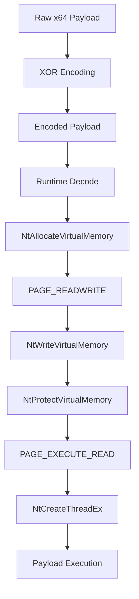
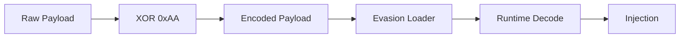

# Evasion

## Direct Syscall Remote Thread Injector

Windows x64 process-injection loader designed for **offensive security operations and adversary simulation**.

### Features

* Direct x64 system calls
* User-mode security hook avoidance
* Cross-process memory operations
* Staged `RW → RX` memory protection
* `NtCreateThreadEx` remote thread execution
* Runtime XOR payload decoding

---

## Execution Flow



---

## Red Team Use

* Process injection during adversary simulation
* User-mode security instrumentation testing
* EDR detection validation
* Memory and thread telemetry assessment
* Process-injection technique comparison

---

## Build Requirements

* Windows x64
* C++17-compatible compiler
* MSYS2 UCRT64 / MinGW-w64
* Python 3.x

### Windows

Build using the MSYS2 UCRT64 environment:

```bash
g++ -o hollow.exe hollow.cpp evasion.cpp syscalls.cpp utils.cpp \
    -O2 -std=c++17 -static -fno-exceptions -fno-rtti
```

### Cross Compilation

```bash
x86_64-w64-mingw32-g++ -o hollow.exe hollow.cpp evasion.cpp syscalls.cpp utils.cpp \
    -O2 -std=c++17 -static -fno-exceptions -fno-rtti
```

---

## Payload

The loader accepts an externally prepared raw Windows x64 payload.

The current encoding mechanism uses:

```text
XOR Key: 0xAA
```

Payload workflow:



---

## Usage

```text
hollow.exe --target <target_process> --payload <encoded_payload>
```

---

## Project Structure

```text
Evasion/
│
├── hollow.cpp
├── evasion.cpp
├── syscalls.cpp
├── syscalls.h
├── utils.cpp
├── payload/
│   └── ...
│
├── .gitignore
└── README.md
```

---

## Classification

```text
Platform  : Windows x64
Technique : Remote Thread Process Injection
Syscalls  : Direct Native System Calls
Memory    : RW → RX
Execution : NtCreateThreadEx
Payload   : Runtime XOR Decoding
```

> **Scope:** Intended for controlled security testing, adversary simulation, and authorized environments.
