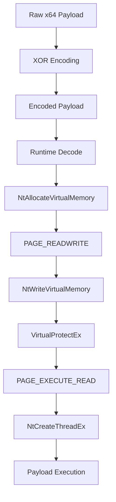
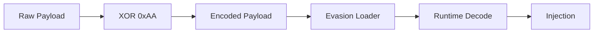

# Evasion

## Direct Syscall Remote Thread Injector

Windows x64 process-injection loader designed for **offensive security operations, adversary simulation, and EDR telemetry subversion**.

### Evasion Vector Breakdown

* **User-Mode Hook Subversion (Elastic EDR Bypass):** Bypasses the user-mode monitoring hooks deployed by modern security agents within `ntdll.dll`. The code skips user-mode API logging and redirection by mapping direct inline assembly stubs via an `extern "C"` linkage envelope to communicate straight with the kernel boundary.
* **Persistent Signature Evasion:** Avoids the noisy fingerprint of persistent Read/Write/Execute (`RWX`) allocations. Memory regions are strictly initialized as safe Read/Write (`PAGE_READWRITE`), populated with the payload stream, and dynamically flipped to Execute/Read (`PAGE_EXECUTE_READ`) via `VirtualProtectEx` only at the millisecond of execution.
* **Heuristic Behavior Subversion:** Avoids process hollowing loops and thread-context hijacking sequences (`NtGetContextThread` / `NtSetContextThread`), which Elastic's behavioral heuristics track heavily. The target primary thread remains untouched, spawning code execution inside an isolated runtime background thread via a raw `NtCreateThreadEx` system call.

---

## Execution Flow



---

## Red Team Use & Telemetry Validation

* Process injection during adversary simulation
* User-mode security instrumentation testing
* EDR detection and hook validation (Tested against Elastic EDR)
* Memory and thread telemetry assessment
* Process-injection technique comparison

---

## Build Requirements

* Windows x64
* C++17-compatible compiler
* MSYS2 UCRT64 / MinGW-w64
* Python 3.x

### Windows

Build using the MSYS2 UCRT64 environment:

```bash
g++ -o hollow.exe hollow.cpp evasion.cpp syscalls.cpp utils.cpp -municode -Wl,-subsystem,console -O2 -std=c++17 -static -fno-exceptions -fno-rtti
```

### Cross Compilation

```bash
x86_64-w64-mingw32-g++ -o hollow.exe hollow.cpp evasion.cpp syscalls.cpp utils.cpp -municode '-Wl,-subsystem,console' -O2 -std=c++17 -static -fno-exceptions -fno-rtti
```

---

## Payload

The loader accepts an externally prepared raw Windows x64 payload.

The current encoding mechanism uses:

```text
XOR Key: 0xAA
```

Payload workflow:



---

## Usage

```text
hollow.exe --target <target_process> --payload <encoded_payload>
```

Example:

```text
.\hollow.exe --target C:\Windows\System32\notepad.exe --payload enc.bin
```

---

## Project Structure

```text
Evasion/
│
├── hollow.cpp
├── hollow.h
├── evasion.cpp
├── evasion.h
├── syscalls.cpp
├── syscalls.h
├── utils.cpp
├── config.h
├── .gitignore
└── README.md
```

---

## Classification

```text
Platform  : Windows x64
Technique : Remote Thread Process Injection
Syscalls  : Direct Native System Calls
Memory    : RW → RX
Execution : NtCreateThreadEx
Payload   : Runtime XOR Decoding
```

---

> Disclaimer: This repository is intended strictly for professional security research, educational telemetry validation, and authorized academic laboratory tracking purposes.
