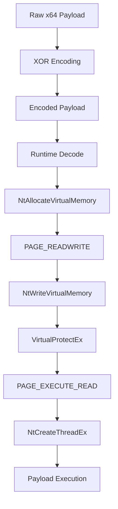
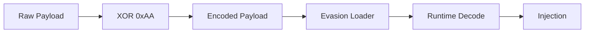

# Evasion

## Direct Syscall Remote Thread Injector

Windows x64 process-injection loader designed for advanced offensive security operations, custom adversary simulation, and user-mode endpoint instrumentation subversion.

### Operational Security Reality (Read Before Deployment)

This framework is engineered to subvert **runtime behavioral heuristics and user-mode EDR hook telemetry**. Testing confirms complete subversion of Elastic EDR runtime hooks during the cross-process injection and thread invocation phases. 

However, because this loader relies on clean Win32/NT system structures, compiling using generic cross-compilers (like Linux MinGW-w64) leaves static binary footprint headers that modern **Kernel-Mode File-System Mini-Filter Drivers** flag instantly upon storage write. To successfully deploy this framework past static file-system signature filters without breaking code integrity, **native compilation on a localized toolchain (MSYS2 UCRT64) or memory-only text packaging pipelines must be utilized.**

### Evasion Vector Breakdown

* **User-Mode Hook Subversion (Elastic EDR Hook Bypass):** Bypasses the active monitoring hooks deployed within `ntdll.dll`. The code skips user-mode API logging and redirection by mapping direct inline assembly stubs via an `extern "C"` linkage envelope to communicate straight with the kernel boundary.
* **Persistent Signature Evasion:** Avoids the noisy fingerprint of persistent Read/Write/Execute (`RWX`) allocations. Memory regions are strictly initialized as safe Read/Write (`PAGE_READWRITE`), populated with the payload stream, and dynamically flipped to Execute/Read (`PAGE_EXECUTE_READ`) via `VirtualProtectEx` only at the millisecond of execution.
* **Heuristic Behavior Subversion:** Avoids process hollowing loops and thread-context hijacking sequences (`NtGetContextThread` / `NtSetContextThread`), which modern behavioral engines heavily track. The target primary thread remains untouched, spawning code execution inside an isolated runtime background thread via a raw `NtCreateThreadEx` system call.

---

## Execution Flow



---

## Red Team Use & Telemetry Validation

* Cross-process memory mapping via native unhooked syscall channels.
* Validating endpoint behavioral rules against independent remote threads.
* Benchmarking host memory scanners against dynamic page protection swaps.
* Tested and validated successful memory execution against Elastic EDR.

---

## Build Requirements

* Windows x64 Natively
* C++17 ISO Standard (`-std=c++17`)
* MSYS2 UCRT64 Environment (Enforces unique machine signatures)
* Python 3.x

### Native Windows Compilation (Recommended for EDR Evasion)

Build natively inside your target workstation MSYS2 UCRT64 shell:

```bash
g++ -o injector.exe injector.cpp evasion.cpp syscalls.cpp utils.cpp -municode -Wl,-subsystem,console -O2 -std=c++17 -static -fno-exceptions -fno-rtti
```

### Cross Compilation (Requires Asset Base64/Obfuscation Packaging)

```bash
x86_64-w64-mingw32-g++ -o injector.exe injector.cpp evasion.cpp syscalls.cpp utils.cpp -municode '-Wl,-subsystem,console' -O2 -std=c++17 -static -fno-exceptions -fno-rtti
```

---

## Payload Workflow

The loader expects an externally obfuscated stageless payload stream.

```text
XOR Key: 0xAA
```



---

## Usage

```text
injector.exe --target <target_process_path> --payload <encoded_payload_path>
```

Example:

```text
.\injector.exe --target C:\Windows\System32\notepad.exe --payload enc.bin
```

---

## Project Structure

```text
Evasion/
│
├── injector.cpp
├── injector.h
├── evasion.cpp
├── evasion.h
├── syscalls.cpp
├── syscalls.h
├── utils.cpp
├── config.h
├── .gitignore
└── README.md
```

---

## Technical Classification

```text
Platform  : Windows x64
Technique : Remote Thread Process Injection
Syscalls  : Direct Native System Calls (Inline Assembly)
Memory    : RW → RX Protective State Transition
Execution : NtCreateThreadEx (Isolated Thread Context)
Payload   : Runtime In-Memory XOR Stream Decoding (0xAA)
```

---

> Disclaimer: This repository is intended strictly for professional security research, educational telemetry validation, and authorized academic laboratory tracking purposes.
